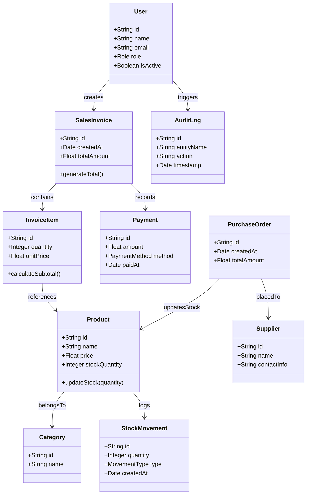

# Class Diagram — StockShield

## Overview

This class diagram represents the core backend structure of the StockShield system.  
The design follows a layered architecture with separation between domain models and service logic.

The system focuses on billing, inventory management, supplier handling, and payment tracking.

---

## Class Diagram

---

## Class Descriptions

### Domain Models (Entities)

| Class | Description |
|-------|------------|
| User | Represents system users such as Admin and Staff. Stores authentication details and role information for access control. |
| Product | Represents an item available in the store. Contains product name, price, and stock quantity. |
| Category | Groups products into logical categories for organization. |
| Supplier | Represents vendors from whom products are purchased. Stores supplier contact details. |
| SalesInvoice | Represents a billing transaction created during a sale. Contains invoice items and total amount. |
| InvoiceItem | Represents a single product entry inside an invoice. Stores quantity and unit price. |
| Payment | Stores payment details for a sales invoice. Supports different payment modes like Cash, UPI, and Card. |
| PurchaseOrder | Represents a stock purchase made from a supplier. Used to increase inventory levels. |
| StockMovement | Tracks stock changes (increase or decrease) due to sales or purchases. |
| AuditLog | Records important system actions for tracking and accountability purposes. |

---

### Service Layer (Conceptual Overview)

| Service | Responsibility |
|---------|---------------|
| AuthService | Handles user authentication and role validation. |
| BillingService | Manages invoice creation and total calculation logic. |
| InventoryService | Handles stock updates and records stock movements. |
| SupplierService | Manages supplier records and purchase orders. |
| AuditService | Logs important system activities. |

---

## Design Notes

- The system follows a layered architecture (Controller → Service → Repository).
- Business logic is handled inside service classes.
- Database operations are abstracted using repository classes.
- Transaction handling ensures invoice creation and stock deduction happen atomically.
- The design allows future extension such as discount strategies or additional payment methods.
