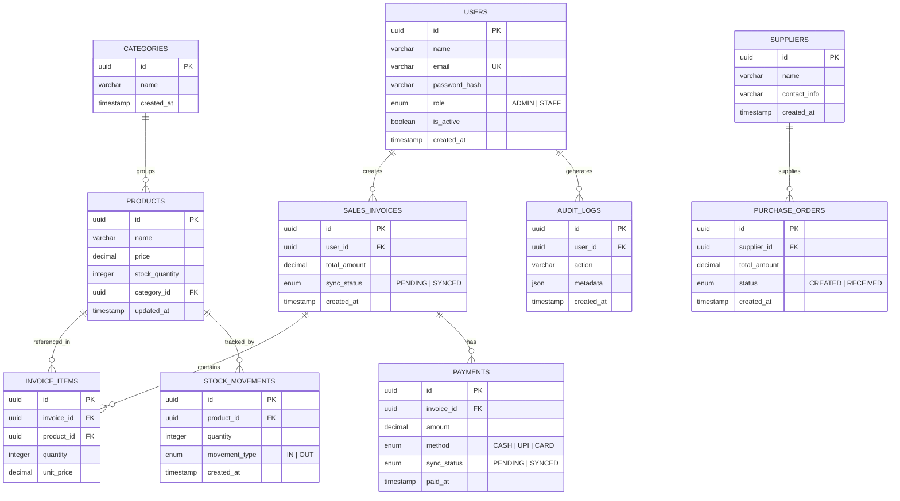

# ER Diagram — StockShield

### **1. Overview**

The StockShield database serves as the core transactional backbone of the retail management system. It is designed to ensure reliable billing, inventory tracking, and payment recording even in environments with unstable internet connectivity.

The system follows a hybrid offline-first model where sales, payments, and stock updates are recorded locally and synchronized with the central server when connectivity is restored. The database schema is structured to maintain financial integrity, stock consistency, and audit transparency across all operations.

The design prioritizes data consistency, normalization, and transactional reliability.

---

### **2. ER Diagram**

---

### **3. Table Summary**

| Table | Description |
| --- | --- |
| `USERS` | Internal system users such as Admin and Staff with role-based access control. |
| `CATEGORIES` | Logical grouping of products for better organization and filtering. |
| `PRODUCTS` | Stores product details including price and available stock quantity. |
| `SUPPLIERS` | Stores supplier/vendor information for stock procurement. |
| `SALES_INVOICES` | Represents billing transactions created during product sales. |
| `INVOICE_ITEMS` | Stores individual product entries within each invoice. |
| `PAYMENTS` | Records financial transactions linked to invoices, including offline sync status. |
| `PURCHASE_ORDERS` | Represents stock purchase transactions from suppliers. |
| `STOCK_MOVEMENTS` | Tracks stock increases (purchases) and decreases (sales). |
| `AUDIT_LOGS` | Maintains logs of important system operations for accountability and recovery. |

---

### **4. Key Indexes**

| Table | Index | Purpose |
| --- | --- | --- |
| `USERS` | `(email)` | Enables fast authentication lookup during login. |
| `PRODUCTS` | `(category_id)` | Optimizes filtering products by category. |
| `SALES_INVOICES` | `(user_id)` | Enables invoice retrieval by staff member. |
| `INVOICE_ITEMS` | `(invoice_id)` | Improves performance when fetching invoice details. |
| `PAYMENTS` | `(sync_status)` | Allows background sync engine to identify pending payments. |
| `STOCK_MOVEMENTS` | `(product_id)` | Enables fast stock history retrieval. |
| `PURCHASE_ORDERS` | `(supplier_id)` | Supports supplier-based purchase tracking. |

These indexes ensure high performance during billing, stock tracking, and reconciliation processes.

---

### **5. Relationship Summary**

- **User Operations:** Internal `USERS` create `SALES_INVOICES` and generate `AUDIT_LOGS` for system actions.
- **Billing Structure:** Each `SALES_INVOICE` contains multiple `INVOICE_ITEMS`, and each invoice can have one or more `PAYMENTS`.
- **Product Management:** Each `PRODUCT` belongs to a `CATEGORY` and may appear in multiple invoice records.
- **Inventory Flow:** `STOCK_MOVEMENTS` record stock increases (purchase) and decreases (sale).
- **Supplier Transactions:** `SUPPLIERS` are linked to `PURCHASE_ORDERS` for inventory restocking.
- **Sync Integrity:** Tables containing financial or transactional data include `sync_status` fields to support hybrid offline-first synchronization.

The relational structure ensures data consistency, referential integrity, and reliable transaction handling across billing and inventory workflows.

