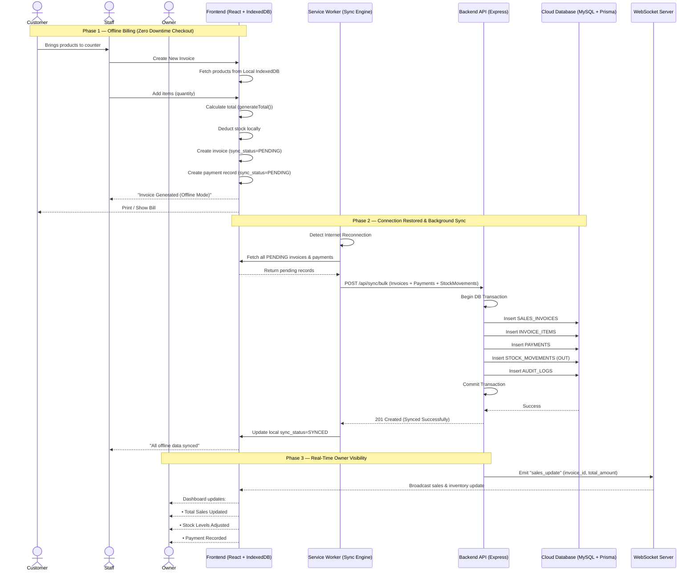

# Sequence Diagram — StockShield

## **Overview**

This diagram illustrates what happens inside StockShield when a retail store generates a bill during an internet outage and later synchronizes all financial and inventory data once connectivity is restored.

It demonstrates how billing continues without interruption using local storage, how transactional integrity is preserved during background synchronization, and how the store owner receives real-time updates once the cloud database is reconciled.

The system follows an offline-first architecture built with React + IndexedDB on the frontend and Node.js + Express + MySQL (via Prisma ORM) on the backend.

---

---

## **Flow Summary**

| Phase | Description | Key Patterns Used |
|-------|------------|------------------|
| **1. Offline Billing** | During internet failure, billing continues using locally cached products and stock data stored in IndexedDB. Invoice, payment, and stock deduction are marked as `PENDING` for later synchronization. | **Offline-First**, Optimistic UI, Local Transactions |
| **2. Background Reconciliation** | When connectivity returns, the Service Worker automatically gathers all pending financial and stock records and sends them in a single bulk API request. | **Background Sync**, Bulk Processing |
| **3. Transactional Cloud Commit** | The backend wraps invoice creation, payment recording, stock deduction, and audit logging inside a single database transaction to guarantee atomic consistency. | **ACID Transaction**, Unit of Work Pattern |
| **4. Real-Time Business Awareness** | After successful commit, the backend emits a WebSocket event so the owner dashboard instantly reflects updated revenue and stock metrics. | **WebSocket**, Pub-Sub |
| **5. Data Integrity & Auditability** | Every sale generates stock movement records and audit logs to ensure financial transparency and recovery capability. | **Audit Trail**, Event Logging |

---

## **System Guarantees**

- Billing never stops during internet outages.
- No invoice is partially saved — all cloud writes are atomic.
- Stock levels remain consistent through tracked stock movements.
- Every payment is recorded with proper audit logging.
- The owner always sees real-time revenue once synchronization completes.
- Sync failures can be retried safely without duplication.

---

## **Architectural Alignment**

This sequence flow aligns directly with:

- Layered backend architecture (Controller → Service → Repository)
- MySQL transactional guarantees
- Prisma ORM transaction handling
- IndexedDB offline persistence
- WebSocket-based live dashboard updates

StockShield ensures operational continuity at the counter and financial correctness in the cloud.
